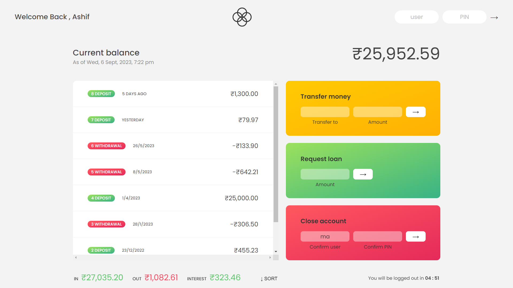

# Bankist App

The Bankist App is a web-based banking application implemented using JavaScript, featuring a wide range of functionalities and leveraging various JavaScript Array methods, date and time handling, internationalization for currency formatting, and more. This project aims to create a user-friendly and feature-rich banking application for managing personal finances.

## Table of contents

- [Overview](#overview)
  - [ID,PASS](#id,pass)
  - [The challenge](#the-challenge)
  - [Screenshot](#screenshot)
  - [Links](#links)
- [Features](#features)
  - [Built with](#built-with)
  - [What I learned](#what-i-learned)
  - [Continued development](#continued-development)
  - [Useful resources](#useful-resources)
- [Author](#author)

## Overview

### ID,PASS

In this Project I Implemented Two Accounts and The ID and Password are:

- loginID1 : ma , Pass : 1111
- loginID2 : s , Pass : 2222

### The challenge

Users should be able to:

- Access the Send and Receive Money
- Able to Request loan
- Can Able to Delete Account

### Screenshot

### Links

- [Live Site URL](https://mhmd-ashif.github.io/Bankistapp)

### Built with

- HTML5 , CSS3
- JavaScript
- Implemented JavaScript Array Methods
- Implemented Timers
- Formatted Date and Time and Currency using the ECMAScript Internationalization API

### What I learned

- Gained Knowledge About Javascript Array Methods and Number,Dates and Timers

### Continued development

- I am deeply immersed in expanding my proficiency in advanced JavaScript concepts, while simultaneously dedicating substantial time to practicing and refining my skills in HTML, CSS, and Bootstrap. Moreover, I am actively engaged in the captivating world of UI/UX design, harnessing the - - power of Figma to create captivating and user-centric interfaces. In addition to Figma, I am also delving into the realm of graphic design, - actively practicing Adobe Photoshop to enhance my abilities in creating visually stunning and impactful designs.

### Useful resources

- [MDN Array](https://developer.mozilla.org/en-US/docs/Web/JavaScript/Reference/Global_Objects/Array) - ✌️ Helped a lot

## Author

- Github - [Mohamed Ashif](https://github.com/Mhmd-Ashif)
- LinkedIn - [@Mohamed Ashif](https://www.linkedin.com/in/mohamed-ashif-341040243/)
- Twitter - [@mhmdashif18](https://twitter.com/mhmdashif18)
